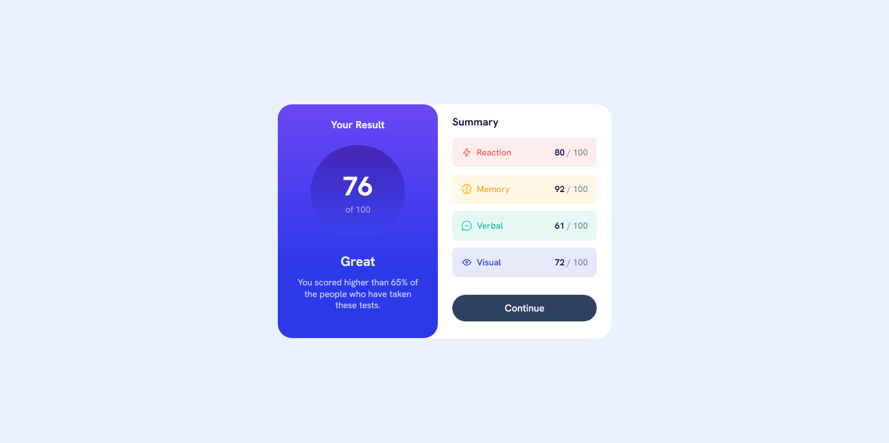

# Frontend Mentor - Results summary component solution

This is a solution to the [Results summary component challenge on Frontend Mentor](https://www.frontendmentor.io/challenges/results-summary-component-CE_K6s0maV). Frontend Mentor challenges help you improve your coding skills by building realistic projects. 

## Table of contents

- [Overview](#overview)
  - [The challenge](#the-challenge)
  - [Screenshot](#screenshot)
  - [Links](#links)
- [My process](#my-process)
  - [Built with](#built-with)
  - [What I learned](#what-i-learned)
  - [Continued development](#continued-development)
  - [Useful resources](#useful-resources)
- [Author](#author)


## Overview

### The challenge

Users should be able to:

- View the optimal layout for the interface depending on their device's screen size
- See hover and focus states for all interactive elements on the page

### Screenshot





### Links
- Live Site URL: [Live Site](https://devjhex-results-summary-component-main-black.vercel.app/)

## My process

### Built with

- Semantic HTML5 markup
- CSS custom properties
- Flexbox
- Mobile-first workflow

### What I learned
I recently learned about the all property as well as the unset property value that helps in resetting the button element to default values which makes it easier for you to style it without conflicts that cause confusion.


```html
<button>Continue</button>

<!-- CSS -->
.button {
  all:unset;
}
```


### Continued development
I want to continue to see how I can improve on how I style my elements most especially in cases like these but I also want to jump up my Tailwind CSS skills on the same type of projects.


### Useful resources

- [MDN](https://developer.mozilla.org) - This has always been helpful and I will never stop recommending it for css properties as well as Javascript concepts well explained.


## Author

- Frontend Mentor - [@Dev-Jhex](https://www.frontendmentor.io/profile/Dev-Jhex)
- Twitter - [@devJhex](https://www.twitter.com/devJhex)


